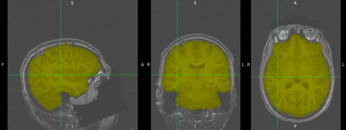
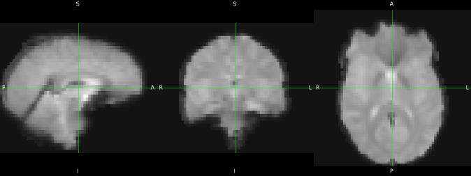
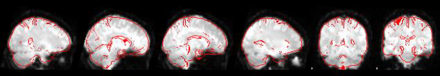
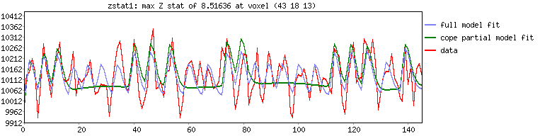
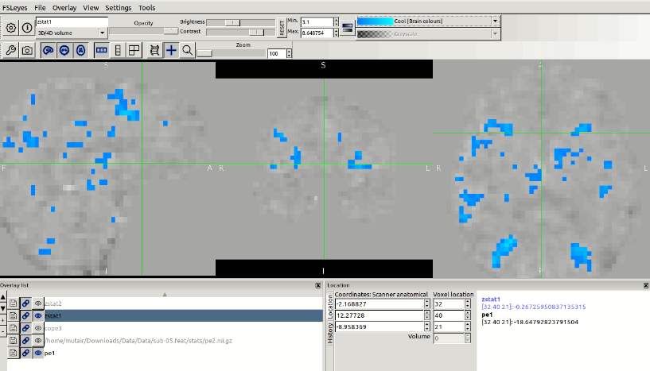
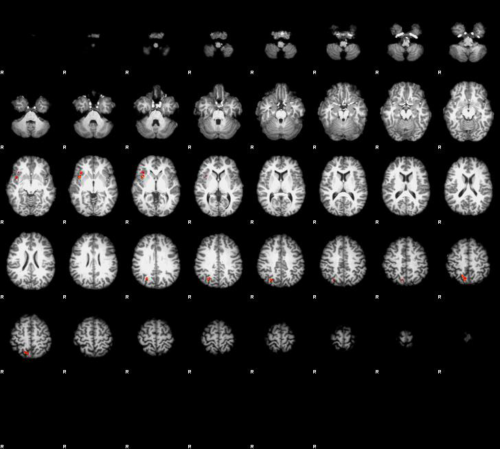
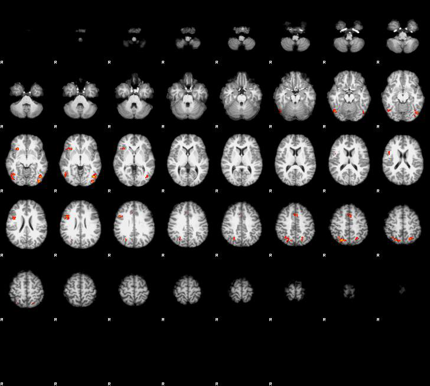
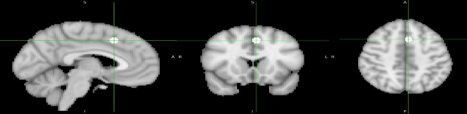
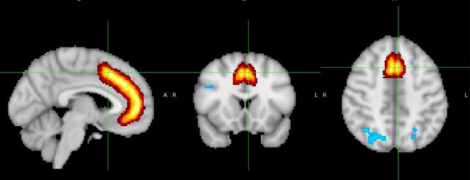

# fMRI Study of Cognitive Control in the Flanker Task

We explore **brain responses to cognitive conflicts** using functional MRI (fMRI) data from the Eriksen flanker task, trying to locate areas that exhibit significant **differences** in activation between the **congruent** and **incongruent** conditions.

## Project Overview

1. Data Quality Control
3. Preprocessing 
4. First-level Analysis
6. Second-level Analysis  
6. Third-level Group Analysis
7. ROI Analysis

## 1. Data Quality Control

- Checked T1 structural images for artifacts.
- Visually inspected functional data for motion artifacts.
- Categorized runs: No visible motion (34), slight motion (11), excessive motion (7).

## 2. Preprocessing

### Skull Stripping

Removed non-brain tissue from structural and functional images using a threshold of 0.2.

### Motion Correction 
Used MCFLIRT algorithm to correct for subject head motion.

### Smoothing

Applied 5mm Gaussian smoothing kernel to reduce noise and increase signal-to-noise ratio.

### Registration

Aligned functional data to MNI152 2mm template for group analysis.

## 3. First-Level Analysis  

- Created design matrix with regressors for congruent and incongruent trials.
- Fit General Linear Model (GLM) to get parameter estimates and contrasts.

The original data (time series at one voxel) vs fitted model.

- Produced thresholded statistical maps (Z > 3.1).

The significant brain activations after thresholding for COPE1 (incongruent)
## 4. Second-Level Analysis
- Combined data from the two runs for each subject using fixed effects model.

Sample results for COPE3 (incongruent - congruent activations) after the 2nd level analysis.

## 5. Third-Level Group Analysis  

- Combined data across all subjects using mixed effects model (FLAME 1)
- Applied cluster-based thresholding for group activation maps.

Sample results for COPE3 (incongruent - congruent activations) after the 3rd level analysis.

## 6. ROI Analysis

Examined activations in specific regions:

- Lateral occipital cortex 
- Paracingulate gyrus
- Insular cortex

Used both anatomical masks and 5mm spherical ROIs centered on activation peaks.

Spherical Mask around the Paracingulate Gyrus

Anatomical Mask of the Paracingulate Gyrus

## Key Findings

- Greater activation for incongruent vs congruent trials, particularly in:
  - Lateral occipital cortex: involved in object recognition and visual processing.
  - Paracingulate gyrus: associated with conflict management.
  - Insular cortex: part of the salience network, involved in detecting relevant stimuli.

These results are consistent with regions known to be involved in conflict processing and visual attention.

## Important Note
For a **step-by-step walkthrough, detailed results and explanations**, check the [fMRI-Study-of-Cognitive-Control-in-the-Flanker-Task.pdf](./fMRI-Study-of-Cognitive-Control-in-the-Flanker-Task.pdf) in the repository
.

## The Data Analysis Toolkit Used

- FSL (FMRIB Software Library) for fMRI data processing and analysis.

## Acknowledgments

This project was completed as part of the Neuroimaging course supervised by [Dr. Meena M. Makary](https://scholar.google.co.kr/citations?user=y_8D7KEAAAAJ&hl=en
) at Cairo University.

The project and scripts were inspired by and builds upon the knowledge gained from the "Andy's Brain Book fMRI Short Course" by [Andrew Jahn](https://medicine.umich.edu/dept/radiology/andrew-jahn-phd)

Course Link: [Andy's Brain Book fMRI Short Course](https://andysbrainbook.readthedocs.io/en/latest/fMRI_Short_Course/fMRI_Intro.html)

